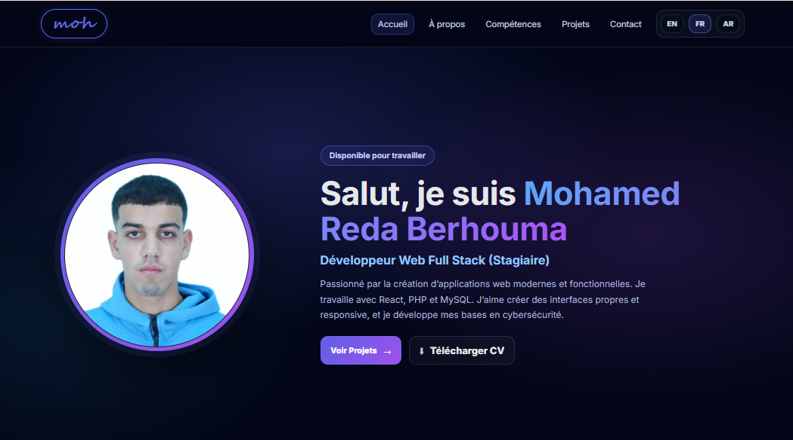

# 🌐 Portfolio Web Application

## 📖 Description

This portfolio is a modern web application designed to showcase my personal and collaborative web development projects.

It allows users to explore each project in detail, including:
- Features and functionalities  
- Technologies used  
- Screenshots  
- Links to source code repositories  

The application is multilingual (French, English, Arabic) and provides a clean and intuitive navigation with a dedicated page for each project.

For team-based projects, a special **Team** section highlights contributors, their roles, and their contact information (GitHub, LinkedIn, email, and phone).

This portfolio was developed using **React** and **Redux** for language management, with a strong focus on user experience, modern design, and dynamic data structure.

---

## 📸 Home Page Preview

<p align="center">
  
</p>

---

## 🚀 Features

- 🌍 Multilingual support (French, English, Arabic)  
- 📂 Project listing with detailed pages  
- 🖼️ Project screenshots and descriptions  
- 🔗 Links to GitHub repositories  
- 👥 Team section for collaborative projects  
- 📱 Responsive design (mobile & desktop)  
- ⚡ Fast and dynamic interface using React  

---

## 🛠️ Technologies Used

- React.js  
- Redux Toolkit  
- JavaScript (ES6+)  
- HTML5  
- CSS3  
- Vite  
- Git & GitHub  

---

## 📦 Installation & Setup

1. Clone the repository:
```bash
git clone https://github.com/your-username/your-repo-name.git
